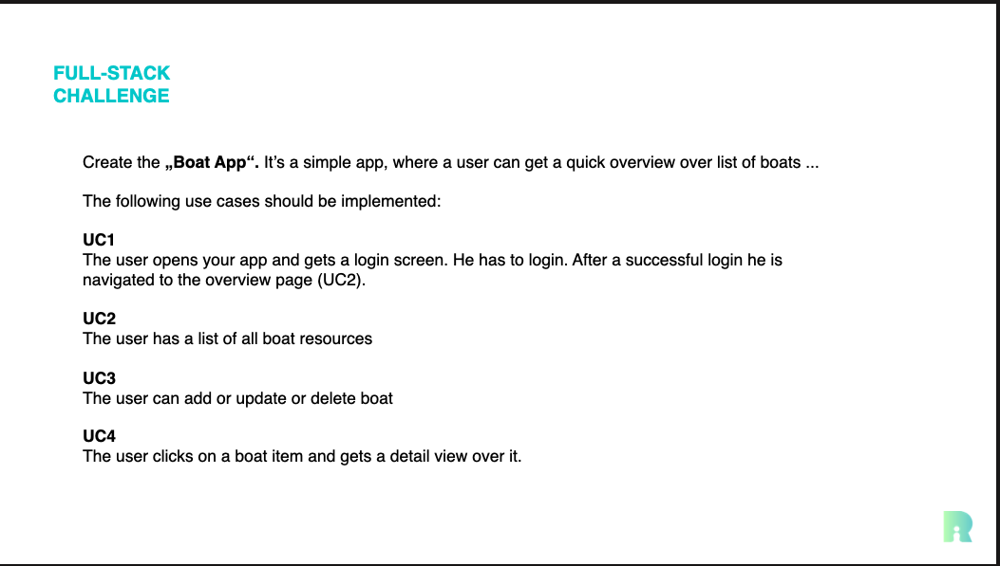
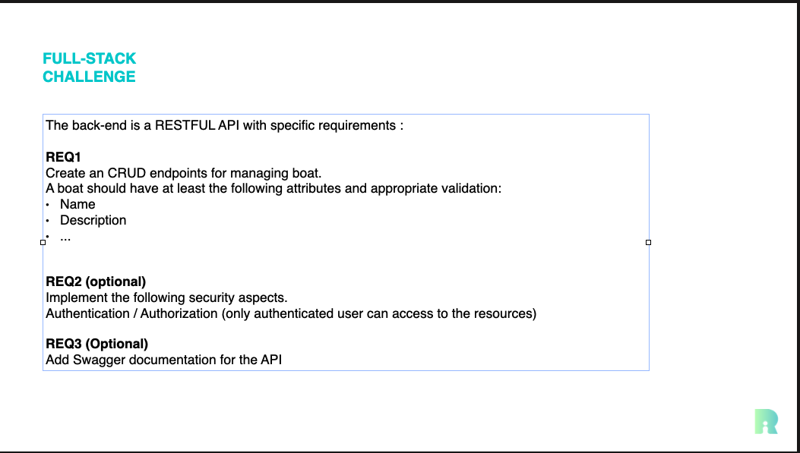

# Boat Management Application

This application is designed for managing boats, allowing users to register, log in, and perform various operations on boat records. The application is comprised of a frontend Angular application and a backend Spring Boot service, with PostgreSQL used as the database.

## Table of Contents

- [Technologies Used](#technologies-used)
- [Project Structure](#project-structure)
- [Setup Instructions](#setup-instructions)
- [Running the Application](#running-the-application)
- [Initial Data](#initial-data)
- [Tests](#tests)

## Requirements

### Frontend



### Backend



### Technologies


## Technologies Used

- **Frontend**:
  - Angular (for building the user interface)
  - RxJS (for reactive programming)
- **Backend**:
  - Spring Boot (for building RESTful APIs)
  - Spring Data JPA (for database interactions)
- **Database**:
  - PostgreSQL (for data storage)
- **Containerization**:
  - Docker Compose (for running the application in containers)

## Setup Instructions

### Prerequisites

- Install Docker and Docker Compose.
- Ensure you have Node.js and npm (for the Angular frontend).
- Ensure you have Java 21 (for the Spring Boot backend).
- Have PostgreSQL installed and running if you plan to run the database locally or with docker.

### Running the Application with Docker

0. Creating the `.env` File

To configure your Docker Compose environment variables, create a `.env` file in the root directory of your project (where your `docker-compose.yml` is located). This file will contain the necessary environment variables for your backend and database services.

Here is an example structure of the `.env` file:

```properties
# Database Configuration
DB_USER=my_database_user
DB_PASSWORD=my_database_password
SPRING_DATASOURCE_URL=jdbc:postgresql://db:5432/boatapp
POSTGRES_DB=boat_management
POSTGRES_USER=my_database_user
POSTGRES_PASSWORD=my_database_password

# JWT Configuration
JWTSECRET=my_secret_key
JWT_EXPIRATION=3600 # expiration time in seconds
```

Replace `my_database_user`, `my_database_password`, `my_secret_key`, and other placeholder values with the actual values you want to use for your application.

Make sure to adjust the values based on your project's requirements.

### Generating a 32-Character Hash with OpenSSL

To generate a secure random string (32 hash) for use as a secret key (e.g., for JWT), you can use the following command in your terminal:

```bash
openssl rand -base64 32
```

This command generates a 32-character hexadecimal string

Run this command in the `/backend ` directory.

```bash
mvn clean install -DskipTests
```

2. Build and run the Docker containers using:

   ```bash
   docker-compose up --build
   ```

3. The application will be up and running at:

   - **Frontend**: `http://localhost:4200`
   - **Backend**: `http://localhost:8080`

### Running Without Docker

If you prefer to run the applications separately without Docker, follow these steps:

#### 1. Initialize the Database

- Make sure PostgreSQL is running.
- Create a database named `boat_management`.

#### 2. Running the Backend

- Navigate to the `/backend` directory and run the following command:
  ```bash
  ./mvnw spring-boot:run
  ```
- The backend will run on `http://localhost:8080`.

#### 3. Running the Frontend

- Navigate to the `/frontend` directory and run:
  ```bash
  npm install
  npm start
  ```
- The frontend will run on `http://localhost:4200`.

### Running PostgreSQL as a Docker Container

If you prefer to run only the PostgreSQL database without using Docker Compose, you can execute the following command to start a PostgreSQL container:

```bash
docker run --name postgres-boatapp -e POSTGRES_PASSWORD=mysecretpassword -d -p 5432:5432 postgres
```

### After Running the Command

To access the PostgreSQL database, you can connect using tools like `psql`, Docker Desktop, or any database client. Use the following connection details:

- **Host**: `localhost` (or `127.0.0.1`)
- **Port**: `5432`
- **Database**: The default database is `postgres`, but you can specify a different database if needed.
- **Username**: `postgres` (default)
- **Password**: The password you set in the `POSTGRES_PASSWORD` environment variable.

### Connecting to PostgreSQL

You can connect to the PostgreSQL instance using the following command:

```bash
psql -h localhost -U postgres -W
```

---

This addition provides users with the flexibility to run the PostgreSQL database as a container independently of Docker Compose while ensuring they have clear instructions on how to connect to the database afterward. Let me know if this meets your expectations or if you need any further modifications!

## Initial Data

Multiple boats are initialized through the `BoatDataLoader` class. When the application starts for the first time, this file populates the PostgreSQL database with sample boat data for testing purposes.

### SWAGGER API

- **Swagger API Access**: You can access the Swagger UI at `http://localhost:8080/swagger-ui/index.html`, where users can interact with and test the API endpoints. To access the authorized routes in the API documentation, you must first execute the `/users/login` endpoint to authenticate.

---

## TESTS

To run the tests for this application, you can use the following commands:

#### Frontend

To run the tests for the Angular frontend application, use:

```bash
ng test
```

This command will execute your unit tests using Karma as the test runner and display the results in your terminal.

#### Backend

To run the tests for the Spring Boot backend application, use:

```bash
mvn test
```

This will execute the unit tests defined in your backend codebase and display the results in the terminal.

After running the tests, you can access the JaCoCo test coverage report at the following location: `/backend/target/site/jacoco/index.html`

#### SonarQube Analysis

You can also run a Docker image of SonarQube and then perform a quality analysis of your codebase using the following commands:

1. **Run SonarQube Docker Image**:

   ```bash
   docker run -d --name sonarqube -e SONAR_ES_BOOTSTRAP_CHECKS_DISABLE=true -p 9000:9000 sonarqube:latest
   ```

2. **After SonarQube is running**, execute the following command to perform a clean build and trigger the Sonar analysis (make sure to replace with your actual SonarQube token):

   ```bash
   mvn clean verify sonar:sonar \
   -Dsonar.projectKey=Boat-App \
   -Dsonar.projectName='Boat App' \
   -Dsonar.host.url=http://localhost:9000 \
   -Dsonar.token=<your-token>
   ```

This command will clean and package your application, run tests, and send the results to your SonarQube server for static code analysis.
